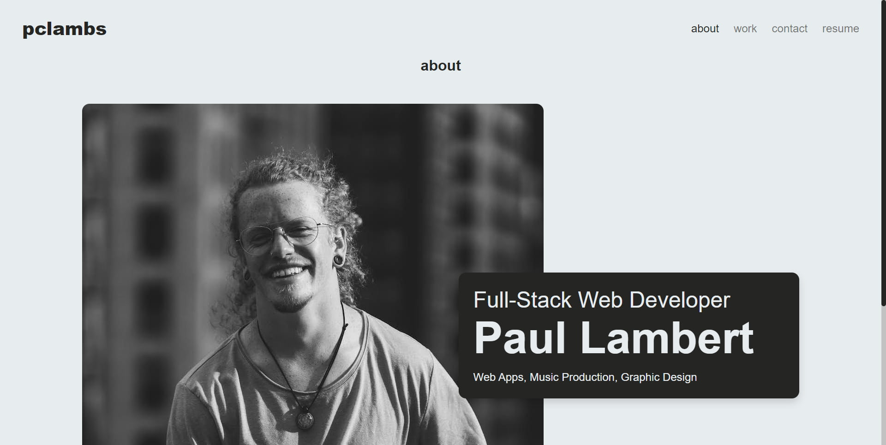

# Web Portfolio

  - This is a personal portfolio website showcasing the work and experience of Paul Lambert. It's built using React and showcases various projects, a brief about section, portfolio section, and a contact form.

  - Deployed Link: 

    https://main--pclambs.netlify.app/

  - Screenshot: 

    
  
## Features

  - Responsive Design: The website is designed to be responsive and works on desktop, tablet, and mobile.
  - Dynamic Year in Footer: The footer dynamically updates to display the current year.
  - Interactive Work Blocks: Each project displayed on the site is interactive and features links to the live project as well as the associated GitHub repository.

## Sections

  - About: A brief introduction about Paul Lambert along with a photograph.
  - Work: A showcase of various projects with interactive blocks.
  - Contact: A section for visitors to reach out.
  - Resume: A link to download Paul's resume.

## Tech Stack

  - React: For building the user interface.
  - CSS: Used for styling the components.

Getting Started

  - Clone the repository:

    `git clone https://github.com/pclambs/react-portfolio.git`

  - Install the dependencies:

    `npm install`

  - Start the development server:

    `npm start`

    The application will be running on http://localhost:5173/.

Deployment

  - The site is deployed on Netlify. Any pushes to the main branch will automatically trigger a redeployment, ensuring the live site is always up-to-date with the latest changes.

Contributions

  - This is a personal portfolio, so contributions are not currently being sought. However, feedback is always welcome.

License

  - MIT